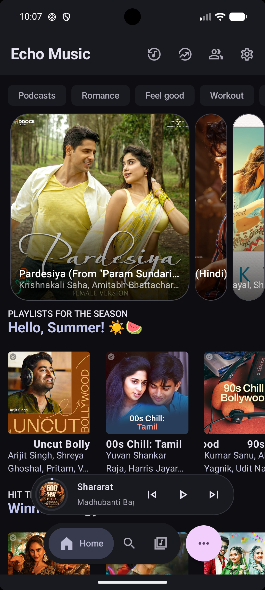
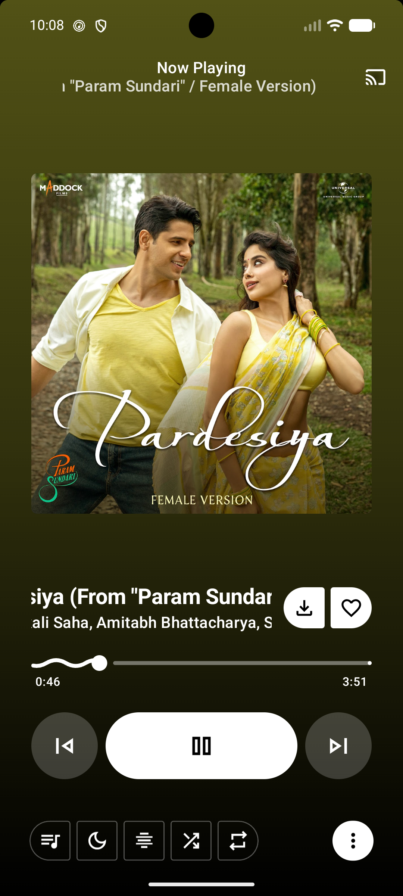
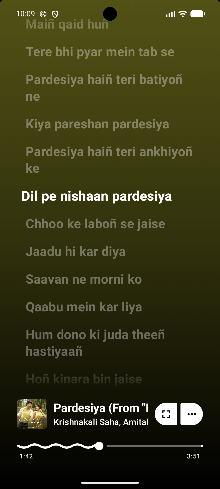
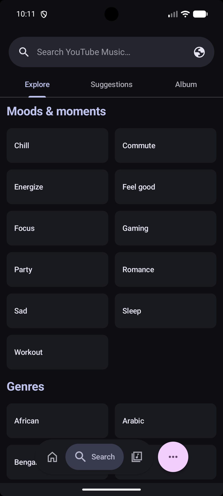

<div align="center">
  

  <h1>Nivukx</h1>

  <p><b>A modern Android music app with ad-free streaming, synced lyrics, offline playback, and an intuitive user experience.</b></p>
</div>

---

## Overview

Nivukx delivers a seamless, premium listening experience by leveraging YouTube Music's vast library — without the ads. It adds powerful extras including offline downloads, real-time synchronized lyrics, and environment-aware music recognition.

> [!IMPORTANT]
> **In-app OTA updates have been permanently removed.** Please update manually via the website. Nivukx is completely free and ad-free; the few ads shown during a manual download help support the ongoing development of this project. Please do not open issues requesting to bring this back. Thank you for your support!

---

- **Discord**: [Join the Nivukx Discord server](https://discord.gg/Xt5hgsJJuA)

---

## Table of Contents

- [Overview](#overview)
- [Screenshots](#screenshots)
- [Features](#features)
- [Installation & Setup](#installation--setup)
- [Support the Project](#support-the-project)
- [Contributors](#contributors)
- [Special Thanks](#special-thanks)

---

## Screenshots

<div align="left">
  <table style="margin: 0 auto; border-collapse: collapse;">
    <tr>
      <td align="center" style="padding: 15px; border: none;">
        <b>Home Screen</b><br><br>
        
      </td>
      <td align="center" style="padding: 15px; border: none;">
        <b>Music Player</b><br><br>
        
      </td>
      <td align="center" style="padding: 15px; border: none;">
        <b>Synchronized Lyrics</b><br><br>
        
      </td>
    </tr>
    <tr>
      <td align="center" style="padding: 15px; border: none;">
        <b>Search & Explore</b><br><br>
        
      </td>
      <td align="center" style="padding: 15px; border: none;">
        <b>Music Library</b><br><br>
        
      </td>
      <td align="center" style="padding: 15px; border: none;">
        <b>Nivukx Find (Recognition)</b><br><br>
        
      </td>
    </tr>
  </table>
</div>

---

## Features

### What's New

> - **Data Saver Mode (Beta)** — Automatically reduces data usage during playback for limited connections.
> - **Settings Search Index** — Quickly find and navigate to any settings option instantly.
> - **Redesigned UI** — Cleaner, faster, and more intuitive interface from the ground up.
> - **Import & Sync from Spotify** — Bring your playlists over with ease and keep them up-to-date with one-tap Fast Sync.
> - **Listen Together** — Sync music in real time, similar to Spotify Jam.
> - **Podcast Support** — Listen to podcasts alongside your music library.
> - **Local Media Support** — Play music files stored directly on your device.
> - **Dynamic Island Support** — Enhanced playback notifications on supported Android devices.

<br>

<details>
<summary><b>Streaming & Playback</b></summary>
<br>

- **Ad-Free** — Stream without any interruptions.
- **Data Saver Mode** — Reduce data consumption when streaming on cellular networks.
- **Seamless Playback** — Switch effortlessly between audio-only and video modes.
- **Background Playback** — Listen while using other apps or with the screen off.
- **Offline Mode** — Download tracks, albums, and playlists via a dedicated download manager.
- **Crossfade** — Smooth transitions between tracks.
- **Canvas Animations** — Visual animations while playing music.

</details>

<details>
<summary><b>Discovery & Nivukx Find</b></summary>
<br>

- **Nivukx Find** — Identify songs playing around you using advanced audio recognition.
- **Nivukx Brain** — An intelligent, on-device engine that analyzes your listening momentum and auto-injects perfectly aligned tracks into your queue. Read more in the [Nivukx Brain Documentation](docs/NIVUKX_REBRAND.md).
- **Smart Recommendations** — Personalized suggestions based on your listening history.
- **Comprehensive Browsing** — Explore Charts, Podcasts, Moods, and Genres.

</details>

<details>
<summary><b>Lyrics</b></summary>
<br>

- **Multiple Lyric Animations** — Choose from various lyric display styles.
- **Word-by-Word Lyrics** — Precise per-word synchronization.
- **Lyrics+** — New lyrics provider for improved accuracy and coverage.
- **AI Translation** — Built-in Google Translate integration for lyrics in any language.

</details>

<details>
<summary><b>Integrations</b></summary>
<br>

- **Music Sharing via Odesli** — Share songs as Song.link for cross-platform listening.
- **Set as Ringtone** — Directly set any song as your device ringtone.

</details>

<details>
<summary><b>Smart Playback</b></summary>
<br>

- **Pause on Mute** — Auto-pause when your device is muted.
- **Resume on Bluetooth** — Playback resumes when headphones or earbuds reconnect.

</details>

<details>
<summary><b>Customization</b></summary>
<br>

- **UI Density Scale** — Adjust interface spacing to your preference.
- **High Refresh Rate Support** — Smoother UI and animations on supported displays.
- **Fluid UI & Animations** — Material 3 Emphasized easing and GPU-accelerated lyrics for a silky smooth, lag-free experience.
- **Hide Player Thumbnail** — Keep the player minimal without album art.
- **Crop Album Art** — Adjust album art display to fit your style.
- **Hide Video Songs** — Filter out video content from your feed.
- **Hide YouTube Shorts** — Keep Shorts out of your music browsing.

</details>

---

## Installation & Setup

### Android Installation

Download the latest pre-compiled APK from the [Nivukx Releases Page](https://github.com/nivash01/Echo/releases/latest).

<details>
<summary><b>Building from Source</b></summary>
<br>

1. **Clone the Repository**

   ```bash
   git clone https://github.com/nivash01/Echo.git Nivukx
   cd Nivukx
   ```

2. **Configure Android SDK**
   Create a `local.properties` file and set your local SDK path. Do not commit this file.

   ```properties
   sdk.dir=/path/to/your/android/sdk
   ```

3. **Configure local development secrets when needed**

   Last.fm and GitHub OAuth credentials are read from `local.properties` first and environment variables second. Do not hardcode or commit them.

   ```properties
   LASTFM_API_KEY=your_lastfm_api_key
   LASTFM_SECRET=your_lastfm_secret
   GH_CLIENT_ID=your_github_client_id
   GH_CLIENT_SECRET=your_github_client_secret
   ```

4. **Firebase Configuration (Optional)**
   Firebase is used for analytics and crash reporting. See [SETUP.md](SETUP.md) for configuration.

5. **Build the Application**
   Nivukx ships as a single **GMS** build variant with Google Cast support. The obsolete FOSS variant has been removed.

   ```bash
   # Universal GMS debug APK
   ./gradlew assembleUniversalGmsDebug

   # Universal GMS release APK
   ./gradlew assembleUniversalGmsRelease

   # CI-equivalent Kotlin verification
   ./gradlew :app:compileUniversalGmsDebugKotlin
   ```

   For additional setup and release signing details, see [SETUP.md](SETUP.md).

</details>

---

## Support the Project

If Nivukx has been useful to you, consider supporting its development.

<div align="left">

- **GitHub Repository**: https://github.com/nivash01/Echo
- **Issues & Feedback**: https://github.com/nivash01/Echo/issues
- **Discord Community**: https://discord.gg/Xt5hgsJJuA

</div>

---

## Contributors

Without the support of this incredible open-source community, none of this would be possible. Thank you to everyone who has contributed to Nivukx!

<!-- readme: contributors -start -->
<table>
<tr><td align="center"><a href="https://github.com/nivash01"></a></td></tr>
</table>
<!-- readme: contributors -end -->


---

## Special Thanks

Nivukx stands on the shoulders of several excellent open-source projects. Sincere thanks to:

| Project                                                                                                                   | Description                                         |
| :------------------------------------------------------------------------------------------------------------------------ | :-------------------------------------------------- |
| **[Metrolist](https://github.com/MetrolistGroup/Metrolist)** & **[Vivi Music](https://github.com/vivizzz007/vivi-music)** | Foundational inspiration and architecture reference |
| **[ArchiveTune](https://github.com/koiverse/ArchiveTune)**                                                                | Material You UI inspiration                         |
| **[Better Lyrics](https://better-lyrics.boidu.dev/)**                                                                     | Lyrics enhancement and synchronization              |
| **[SimpMusic](https://github.com/maxrave-dev/SimpMusic)**                                                                 | Lyrics implementation reference                     |
| **[Music Recognizer](https://github.com/aleksey-saenko/MusicRecognizer)**                                                 | Audio recognition (Nivukx Find)                     |
| **[BravePipe](https://github.com/bravepipeproject/BravePipe)**                                                            | Decryption handling and backup playback engine      |

---

## Legal Disclaimer & Terms of Use

### 1. 100% Free, Open-Source & Strictly Non-Commercial

Nivukx is a fully open-source project created purely for educational purposes and personal use. We do not sell this application, nor do we monetize it in any way. There are no advertisements, no premium features, no subscriptions, and no hidden fees within the app. This project has absolutely no commercial value or financial intent.

### 2. A Custom Browser with Content Filtering

Nivukx acts strictly as a specialized, third-party web browser and client. It simply parses the publicly available website content and APIs of YouTube and YouTube Music, rendering them in a custom user interface. The ad-free experience it provides is fundamentally no different from using a standard web browser (like Chrome, Firefox, or Brave) equipped with a common ad-blocking extension (such as uBlock Origin).

### 3. Support Content Creators

We deeply respect the hard work of artists, musicians, and content creators. We strongly encourage all users to subscribe to [YouTube Premium](https://www.youtube.com/premium). Purchasing a Premium subscription is the best way to financially support the creators you listen to and ensure the continued growth of the platform. Nivukx is built as a proof-of-concept for developers and enthusiasts, not to harm creators' revenues.

### 4. No Hosting of Copyrighted Material

We do not host, upload, distribute, or store any audio, video, or copyrighted media files on our own servers. All content accessed through this application is stored entirely on Google's/YouTube's servers and remains the property of their respective copyright owners. The app merely acts as a conduit to stream publicly accessible links.

### 5. User Responsibility & Legal Contact

The software is provided "AS IS", without warranty of any kind. The developers of Nivukx do not encourage or condone piracy. Users are solely responsible for ensuring their usage of this app complies with their local copyright laws and the Terms of Service of the platforms they access.

Because we do not host any media files, we cannot process DMCA takedown requests for audio or video content. However, if you represent a copyright holder or have legal concerns regarding the open-source code itself, please contact us via email at: [GitHub repository](https://github.com/nivash01/Echo)

---

<div align="center">
  <p>Licensed under <a href="LICENSE">GPL-3.0</a></p>
</div>